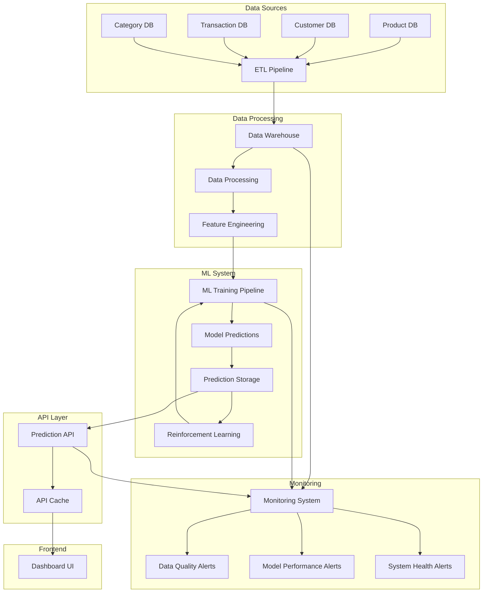
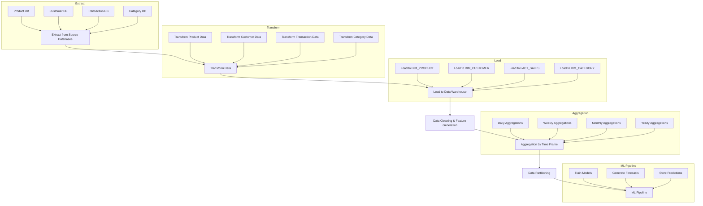
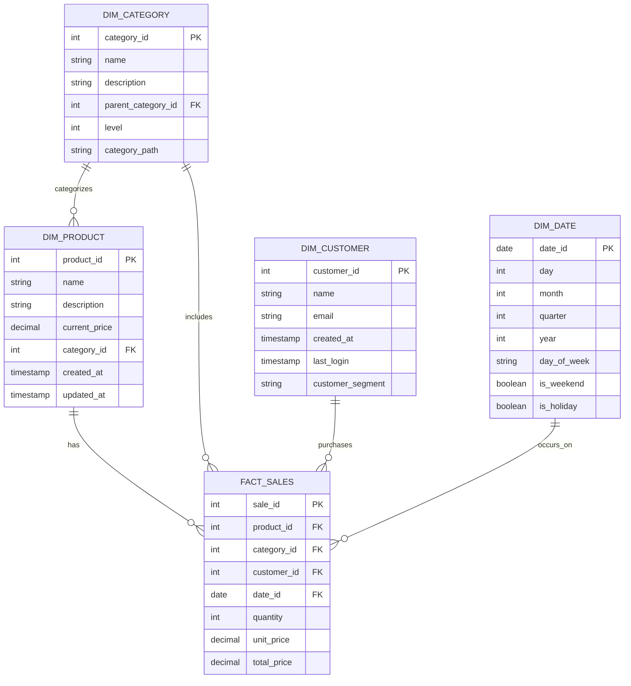
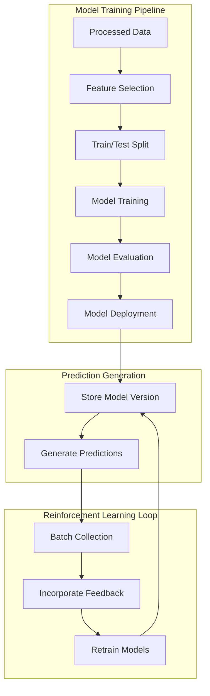
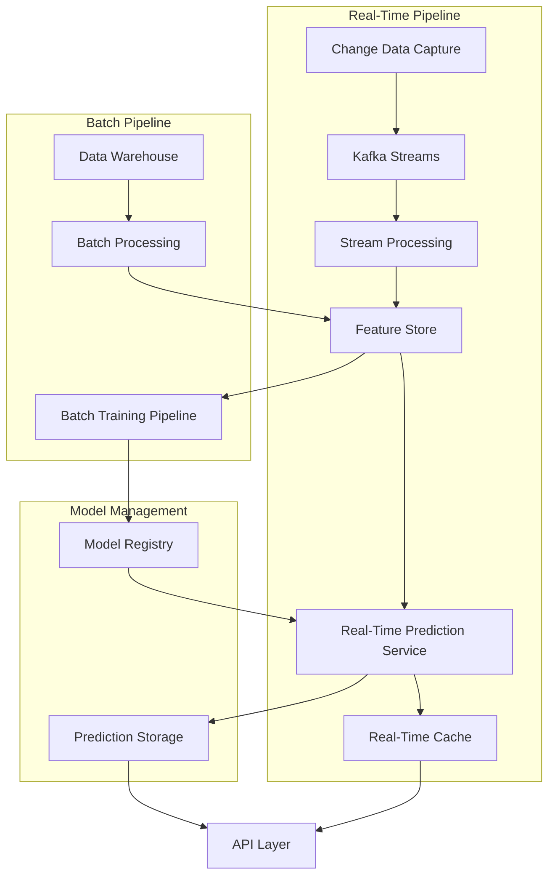
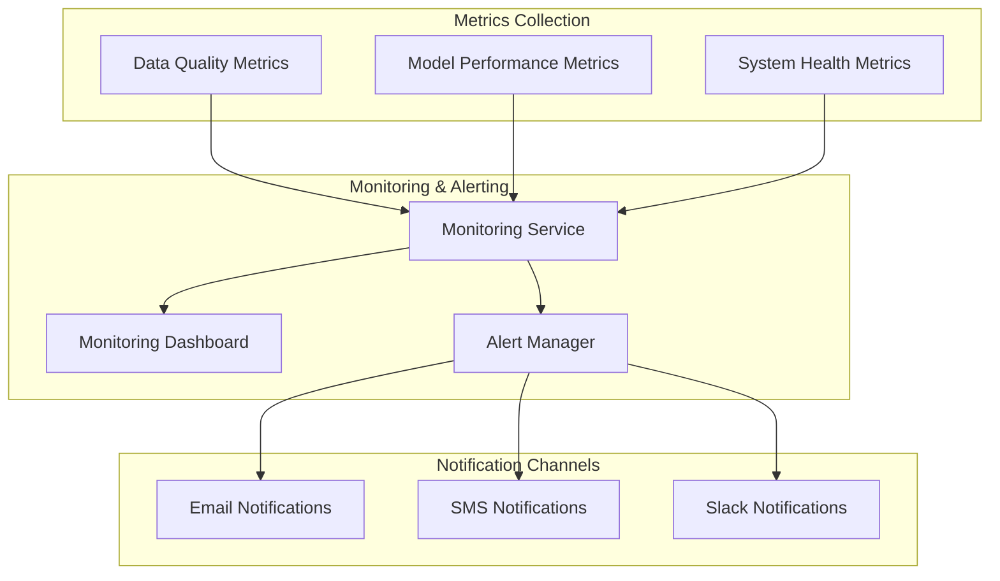

# E-commerce Product Prediction System Design

A comprehensive design document for a scalable system that predicts top-selling products by category over different time frames.

## Table of Contents

1. [Problem Statement](#problem-statement)
2. [Requirements](#requirements)
   - [Functional Requirements](#functional-requirements)
   - [Non-Functional Requirements](#non-functional-requirements)
3. [High-Level Design](#high-level-design)
4. [Data Architecture](#data-architecture)
5. [API Design](#api-design)
6. [ML Pipeline](#ml-pipeline)
7. [Real-Time Processing](#real-time-processing)
8. [Challenges & Solutions](#challenges--solutions)
   - [Real-Time Prediction Challenges](#real-time-prediction-challenges)
   - [Prediction Accuracy Challenges](#prediction-accuracy-challenges)
   - [Consistency & Availability Challenges](#consistency--availability-challenges)
9. [Monitoring & Alerting](#monitoring--alerting)
10. [Implementation Roadmap](#implementation-roadmap)

## Problem Statement

E-commerce marketplace sellers need data-driven insights to optimize their inventory, pricing, and marketing strategies. Currently, they lack the ability to predict which products will be top sellers in different categories over various time frames (week, month, year). This makes it difficult for them to make informed business decisions, leading to potential revenue loss, excess inventory, or stockouts.

We need to develop a feature that can analyze historical transaction data and predict the top-selling products by category over different selectable time frames. This will help sellers optimize their business operations and increase their revenue on the marketplace.

## Requirements

### Functional Requirements

1. **User Scale**: Support 1 million Daily Active Users (DAU)
2. **Data Source**: Initially focus on historical transactions with scope for future expansion
3. **Category Support**: Handle 100 categories with pagination (top 5 categories initially)
4. **Time Frame Support**: 
   - Week, month, and year initially
   - Scalable architecture for future time frames (quarter, half-yearly, etc.)
5. **Data Integration**:
   - Connect to existing SQL databases for products, customers, transactions, categories
   - Design ETL modules to move data to a Data Warehouse
6. **Data Processing**:
   - Clean and parse data for current and future use cases
   - Prepare data for ML processing
7. **Prediction Capabilities**:
   - Forecast top-selling products by category
   - Provide confidence scores for predictions
   - Support different time frames for predictions
8. **Continuous Learning**:
   - Implement reinforcement learning with feedback loops
   - Support async jobs and batching for model retraining

### Non-Functional Requirements

1. **Performance**:
   - API response time under 100ms for 95% of requests
   - Support for high-throughput query patterns
   - Efficient handling of 1M DAU
2. **Scalability**:
   - Horizontal scaling for all components
   - Support for increasing data volume and user base
   - Efficient handling of traffic spikes
3. **Availability**:
   - 99.9% system availability
   - Graceful degradation during partial outages
4. **Consistency**:
   - Near real-time data processing for fresh predictions
   - Consistent prediction results across replicated services
5. **Security**:
   - Secure access to prediction data
   - Protection of sensitive seller and transaction information
6. **Maintainability**:
   - Modular architecture for easy updates
   - Comprehensive monitoring and alerting
   - Well-documented code and architecture

## High-Level Design



### Key Components

1. **Data Sources**:
   - Product Database: Contains product information, pricing, and metadata
   - Customer Database: Contains customer profiles and segments
   - Transaction Database: Contains historical purchase data
   - Category Database: Contains category hierarchy and relationships

2. **Data Processing**:
   - ETL Pipeline: Extracts data from source systems, transforms it, and loads it into the data warehouse
   - Data Warehouse: Stores structured data in a dimensional model optimized for analytics
   - Data Processing: Cleans, validates, and prepares data for feature engineering
   - Feature Engineering: Creates features for ML models based on raw and derived data

3. **ML System**:
   - ML Training Pipeline: Trains prediction models on historical data
   - Model Predictions: Generates forecasts for different time frames
   - Prediction Storage: Stores prediction results with metadata
   - Reinforcement Learning: Improves models based on actual sales feedback

4. **API Layer**:
   - Prediction API: Serves predictions to frontend applications
   - API Cache: Improves response time for frequent queries

5. **Frontend**:
   - Dashboard UI: Seller-facing interface for viewing predictions

6. **Monitoring**:
   - Data Quality Alerts: Ensures data integrity and freshness
   - Model Performance Alerts: Tracks prediction accuracy
   - System Health Alerts: Monitors system components and performance

### Data Flow



#### Key Data Flow Steps:

1. **Extract from Source Databases**:
   - Extract data from Product DB
   - Extract data from Customer DB
   - Extract data from Transaction DB
   - Extract data from Category DB

2. **Transform Data**:
   - Transform Product Data
   - Transform Customer Data
   - Transform Transaction Data
   - Transform Category Data

3. **Load to Data Warehouse**:
   - Load to DIM_PRODUCT
   - Load to DIM_CUSTOMER
   - Load to FACT_SALES
   - Load to DIM_CATEGORY

4. **Data Cleaning & Feature Generation**:
   - Clean and validate data
   - Generate features for ML models
   - Prepare data for aggregation

5. **Aggregation by Time Frame**:
   - Create daily aggregations
   - Create weekly aggregations
   - Create monthly aggregations
   - Create yearly aggregations

6. **Data Partitioning**:
   - Partition data by time periods
   - Partition data by categories
   - Optimize for query performance

7. **ML Pipeline**:
   - Train prediction models
   - Generate forecasts
   - Store prediction results

## Data Architecture



### Time-Based Data Storage

For efficient time-based querying, we implement:

1. **Date Dimension**: A comprehensive date dimension table with pre-computed attributes for efficient time-based querying
2. **Time-Based Partitioning**: Data warehouse tables partitioned by time for efficient querying
3. **Pre-Aggregated Views**: Materialized views for different time granularities:
   ```sql
   -- Example of pre-aggregated tables
   CREATE TABLE agg_sales_daily (
     date_id DATE,
     category_id INT,
     product_id INT,
     total_quantity INT,
     total_amount DECIMAL(18,2),
     num_transactions INT,
     avg_unit_price DECIMAL(10,2),
     PRIMARY KEY (date_id, category_id, product_id)
   );
   
   CREATE TABLE agg_sales_weekly (
     year INT,
     week INT,
     category_id INT,
     product_id INT,
     total_quantity INT,
     total_amount DECIMAL(18,2),
     num_transactions INT,
     avg_unit_price DECIMAL(10,2),
     week_start_date DATE,
     week_end_date DATE,
     PRIMARY KEY (year, week, category_id, product_id)
   );
   
   CREATE TABLE agg_sales_monthly (
     year INT,
     month INT,
     category_id INT,
     product_id INT,
     total_quantity INT,
     total_amount DECIMAL(18,2),
     num_transactions INT,
     avg_unit_price DECIMAL(10,2),
     month_start_date DATE,
     month_end_date DATE,
     PRIMARY KEY (year, month, category_id, product_id)
   );
   ```

4. **Prediction Storage**: NoSQL document store for flexible prediction storage:
   ```json
   {
     "prediction_id": "uuid",
     "time_frame": "week",
     "period_start": "2025-07-25T00:00:00Z",
     "period_end": "2025-08-01T23:59:59Z",
     "generation_timestamp": "2025-08-01T15:05:35Z",
     "model_version": "1.0.0",
     "categories": [
       {
         "category_id": 42,
         "category_name": "Electronics",
         "predicted_sales_amount": 1250000.00,
         "confidence_score": 0.89,
         "rank": 1,
         "top_products": [
           {
             "product_id": 1234,
             "product_name": "Smartphone X",
             "predicted_quantity": 500,
             "predicted_amount": 450000.00,
             "confidence_score": 0.92,
             "rank": 1
           },
           // More products...
         ]
       },
       // More categories...
     ]
   }
   ```

## API Design

### Prediction API Endpoints

#### Get Top Categories
```
GET /api/v1/predictions/categories
```

Query Parameters:
- `timeFrame`: week|month|year (required)
- `date`: YYYY-MM-DD (optional, defaults to current date)
- `limit`: Number of categories to return (optional, defaults to 5)
- `page`: Page number for pagination (optional, defaults to 1)

Response:
```json
{
  "timeFrame": "week",
  "periodStart": "2025-07-25T00:00:00Z",
  "periodEnd": "2025-08-01T23:59:59Z",
  "totalCategories": 100,
  "page": 1,
  "limit": 5,
  "categories": [
    {
      "categoryId": 42,
      "categoryName": "Electronics",
      "predictedSalesAmount": 1250000.00,
      "confidenceScore": 0.89
    },
    // More categories...
  ]
}
```

#### Get Top Products by Category
```
GET /api/v1/predictions/categories/{categoryId}/products
```

Query Parameters:
- `timeFrame`: week|month|year (required)
- `date`: YYYY-MM-DD (optional, defaults to current date)
- `limit`: Number of products to return (optional, defaults to 5)
- `page`: Page number for pagination (optional, defaults to 1)

Response:
```json
{
  "categoryId": 42,
  "categoryName": "Electronics",
  "timeFrame": "week",
  "periodStart": "2025-07-25T00:00:00Z",
  "periodEnd": "2025-08-01T23:59:59Z",
  "totalProducts": 150,
  "page": 1,
  "limit": 5,
  "products": [
    {
      "productId": 1234,
      "productName": "Smartphone X",
      "predictedQuantity": 500,
      "predictedAmount": 450000.00,
      "confidenceScore": 0.92
    },
    // More products...
  ]
}
```

### GraphQL API (Alternative)

For more flexible querying, we also provide a GraphQL API:

```graphql
# GraphQL schema for efficient querying
type Category {
  id: ID!
  name: String!
  predictedSalesAmount: Float!
  confidenceScore: Float!
  topProducts(limit: Int = 5): [Product!]!
}

type Product {
  id: ID!
  name: String!
  predictedQuantity: Int!
  predictedAmount: Float!
  confidenceScore: Float!
}

type PredictionResult {
  timeFrame: TimeFrame!
  periodStart: String!
  periodEnd: String!
  categories(limit: Int = 5, page: Int = 1): [Category!]!
  totalCategories: Int!
}

enum TimeFrame {
  DAY
  WEEK
  MONTH
  YEAR
}

type Query {
  predictions(timeFrame: TimeFrame!, date: String): PredictionResult!
  categoryPrediction(id: ID!, timeFrame: TimeFrame!, date: String): Category
}
```

## ML Pipeline



### ML Pipeline Components

1. **Feature Engineering**:
   - Time-based features (day of week, month, seasonality)
   - Product features (price, category, attributes)
   - Historical sales patterns (velocity, acceleration)
   - Category-level aggregations

2. **Model Training**:
   - Initial approach: Logistic regression for simplicity and interpretability
   - Future enhancements: Gradient boosting, neural networks
   - Separate models for different time frames
   - Category-specific models for top categories

3. **Model Evaluation**:
   - Metrics: MAPE (Mean Absolute Percentage Error), RMSE
   - Cross-validation with time-series split
   - A/B testing for model improvements
   - Confidence score calibration

4. **Reinforcement Learning**:
   - Feedback loop from actual sales data
   - Continuous model improvement
   - Adaptive learning rates based on performance
   - Multi-armed bandit approach for model selection

## Real-Time Processing



### Real-Time Processing Components

1. **Change Data Capture (CDC)**:
   - Captures changes from transaction systems in real-time
   - Uses Debezium for CDC from transaction databases
   - Streams changes to Kafka topics
   - Partitions data by category for parallel processing

2. **Stream Processing**:
   - Uses Kafka Streams or Apache Flink for stateful processing
   - Maintains in-memory state for recent transactions
   - Computes running aggregates by category and product
   - Implements sliding window aggregations (1h, 6h, 24h, 7d)

3. **Feature Store**:
   - Provides consistent features for both batch and real-time pipelines
   - Manages feature versioning and lineage
   - Supports time-travel capabilities for point-in-time features
   - Implements online and offline storage for different access patterns

4. **Dual Pipeline Approach**:
   - Real-time pipeline for immediate updates
   - Batch pipeline for comprehensive processing
   - Feature reconciliation between pipelines
   - Consistent prediction generation

## Challenges & Solutions

### Real-Time Prediction Challenges

1. **Data Freshness vs. Accuracy Trade-off**:
   - **Challenge**: New sales transactions continuously occur during ETL and prediction generation
   - **Solution**: Implement dual-pipeline approach with CDC for real-time updates and batch processing for comprehensive analysis

2. **Processing Latency**:
   - **Challenge**: Real-time processing introduces latency in the prediction pipeline
   - **Solution**: Use stream processing with sliding windows and incremental updates to minimize latency

3. **Feature Consistency**:
   - **Challenge**: Ensuring features are consistent between batch and real-time pipelines
   - **Solution**: Implement a feature store with versioning and time-travel capabilities

4. **Implementation**:
   ```java
   // Pseudo-code for sliding window implementation
   StreamsBuilder builder = new StreamsBuilder();
   
   // Read from transactions topic
   KStream<String, Transaction> transactions = builder.stream("transactions");
   
   // Group by category and product, with 1-day window
   transactions
       .groupBy((key, transaction) -> 
           new CategoryProductKey(transaction.getCategoryId(), transaction.getProductId()))
       .windowedBy(TimeWindows.of(Duration.ofDays(1)))
       .aggregate(
           () -> new SalesAggregate(0, 0.0, 0, 0.0),
           (key, transaction, aggregate) -> {
               aggregate.totalQuantity += transaction.getQuantity();
               aggregate.totalAmount += transaction.getTotalPrice();
               aggregate.numTransactions += 1;
               aggregate.avgUnitPrice = aggregate.totalAmount / aggregate.totalQuantity;
               return aggregate;
           },
           Materialized.as("daily-sales-aggregates")
       )
       .toStream()
       .to("daily-aggregates");
   ```

### Prediction Accuracy Challenges

1. **Cold Start Problem**:
   - **Challenge**: New products have no historical data for predictions
   - **Solution**: Use category averages and similar product data for initial predictions

2. **Seasonal Variations**:
   - **Challenge**: Sales patterns vary by season, holidays, and special events
   - **Solution**: Include cyclical time features and special event markers in the model

3. **Promotion Effects**:
   - **Challenge**: Promotions and discounts significantly impact sales patterns
   - **Solution**: Include promotion awareness in features and create separate models for promotional periods

4. **Confidence Scoring**:
   - **Challenge**: Providing accurate confidence scores for predictions
   - **Solution**: Implement ensemble methods and proper calibration techniques

5. **Implementation**:
   ```python
   # Pseudo-code for confidence scoring
   def calculate_confidence_score(predictions, historical_accuracy, data_completeness):
       # Base confidence on model's historical accuracy
       base_confidence = historical_accuracy
       
       # Adjust based on data completeness
       data_factor = min(1.0, data_completeness / 0.8)  # Normalize to 1.0 at 80% completeness
       
       # Adjust based on prediction variance in ensemble
       prediction_variance = np.var(predictions) / np.mean(predictions)
       variance_factor = 1.0 - min(0.5, prediction_variance)  # Cap the penalty at 0.5
       
       # Calculate final confidence score
       confidence_score = base_confidence * data_factor * variance_factor
       
       return min(1.0, max(0.0, confidence_score))  # Ensure between 0 and 1
   ```

### Consistency & Availability Challenges

1. **CAP Theorem Trade-offs**:
   - **Challenge**: Balancing consistency and availability in a distributed system
   - **Solution**: Use different consistency models for different components:
     - Strong consistency for transaction processing
     - Eventual consistency for prediction results
     - Read-after-write consistency for user interactions

2. **Data Replication**:
   - **Challenge**: Maintaining consistency across replicated data stores
   - **Solution**: Implement tiered replication strategy with synchronous replication for critical data and asynchronous replication for analytics

3. **Partial Failures**:
   - **Challenge**: Handling partial system failures without affecting user experience
   - **Solution**: Implement circuit breakers, fallback mechanisms, and graceful degradation

4. **Implementation**:
   ```java
   // Circuit breaker pattern implementation
   public class CircuitBreaker {
     private enum State { CLOSED, OPEN, HALF_OPEN }
     
     private State state = State.CLOSED;
     private int failureCount = 0;
     private long lastFailureTime;
     
     private final int failureThreshold;
     private final long resetTimeout;
     
     public CircuitBreaker(int failureThreshold, long resetTimeout) {
       this.failureThreshold = failureThreshold;
       this.resetTimeout = resetTimeout;
     }
     
     public <T> T execute(Supplier<T> operation) throws Exception {
       if (state == State.OPEN) {
         if (System.currentTimeMillis() - lastFailureTime > resetTimeout) {
           state = State.HALF_OPEN;
         } else {
           throw new CircuitBreakerOpenException();
         }
       }
       
       try {
         T result = operation.get();
         if (state == State.HALF_OPEN) {
           state = State.CLOSED;
           failureCount = 0;
         }
         return result;
       } catch (Exception e) {
         recordFailure();
         throw e;
       }
     }
     
     private void recordFailure() {
       failureCount++;
       lastFailureTime = System.currentTimeMillis();
       if (failureCount >= failureThreshold || state == State.HALF_OPEN) {
         state = State.OPEN;
       }
     }
   }
   ```

## Monitoring & Alerting



### Key Metrics to Monitor

1. **Data Quality Metrics**:
   - Data freshness (time since last update)
   - Missing values percentage
   - Anomaly detection in data distributions
   - Schema validation errors

2. **Model Performance Metrics**:
   - Prediction accuracy vs. actual sales
   - Model drift detection
   - Feature importance stability
   - Confidence score distribution

3. **System Health Metrics**:
   - API response times
   - Error rates
   - Resource utilization (CPU, memory, disk)
   - Queue lengths for async jobs

### Alerting Strategy

1. **Alert Severity Levels**:
   - P0: Critical - Immediate action required (system down)
   - P1: High - Urgent action required (major functionality affected)
   - P2: Medium - Action required within business hours (minor functionality affected)
   - P3: Low - Action required in next sprint (potential issues)

2. **Alert Routing**:
   - P0/P1: SMS, email, and Slack to on-call team
   - P2: Email and Slack to responsible team
   - P3: Slack to responsible team

3. **Alert Correlation**:
   - Group related alerts to reduce noise
   - Implement root cause analysis
   - Provide context with alerts

### Implementation

```java
// Service health monitoring
public class HealthMonitor {
  private final Map<String, HealthCheck> healthChecks = new HashMap<>();
  private final AlertManager alertManager;
  
  public void registerHealthCheck(String serviceName, HealthCheck check) {
    healthChecks.put(serviceName, check);
  }
  
  public void runHealthChecks() {
    Map<String, HealthStatus> results = new HashMap<>();
    
    for (Map.Entry<String, HealthCheck> entry : healthChecks.entrySet()) {
      String serviceName = entry.getKey();
      HealthCheck check = entry.getValue();
      
      try {
        HealthStatus status = check.check();
        results.put(serviceName, status);
        
        if (!status.isHealthy()) {
          alertManager.sendAlert(new ServiceUnhealthyAlert(serviceName, status.getMessage()));
        }
      } catch (Exception e) {
        results.put(serviceName, HealthStatus.unhealthy("Check failed: " + e.getMessage()));
        alertManager.sendAlert(new ServiceUnhealthyAlert(serviceName, "Health check failed: " + e.getMessage()));
      }
    }
    
    // Publish health metrics
    publishHealthMetrics(results);
  }
}
```

## Implementation Roadmap

### Phase 1: Data Foundation (Q3 2025)
- Set up Data Warehouse schema
- Implement ETL pipeline for historical data
- Establish data quality monitoring
- Create basic data aggregations by time frame

### Phase 2: ML Pipeline Development (Q4 2025)
- Implement feature engineering pipeline
- Develop initial prediction model (logistic regression)
- Create model evaluation framework
- Set up model registry

### Phase 3: Prediction Storage and API (Q1 2026)
- Implement NoSQL storage for predictions
- Develop REST API endpoints
- Add caching layer for API responses
- Implement pagination

### Phase 4: Reinforcement Learning (Q2 2026)
- Develop feedback collection mechanism
- Implement batch processing for model retraining
- Create automated retraining pipeline
- Add model performance monitoring

### Phase 5: UI Integration and Scaling (Q3 2026)
- Support UI integration
- Optimize for performance at scale
- Implement advanced caching strategies
- Add support for additional time frames
