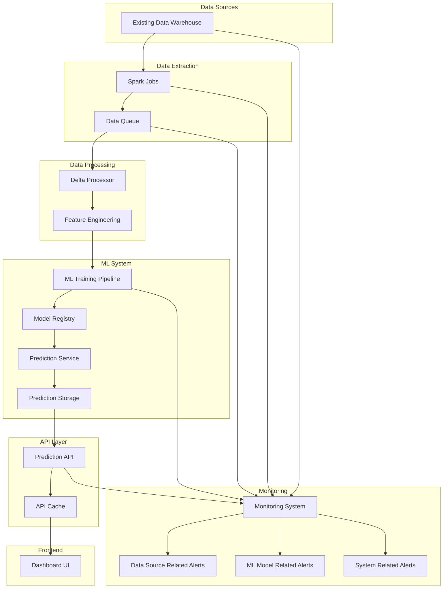
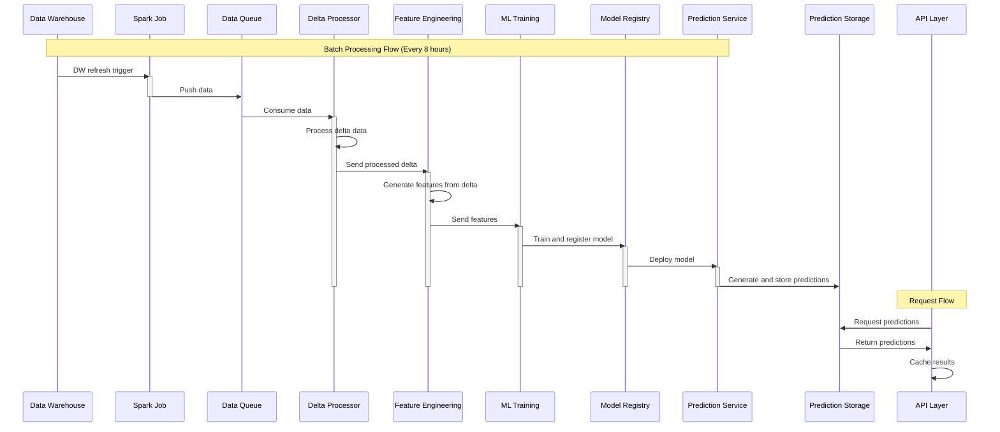
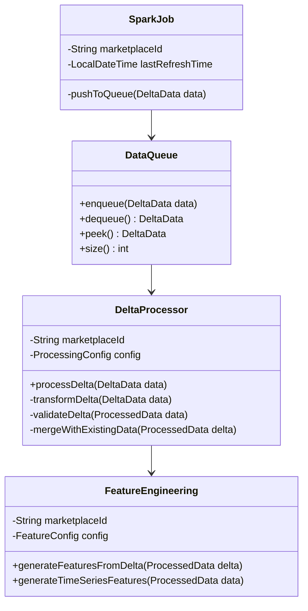
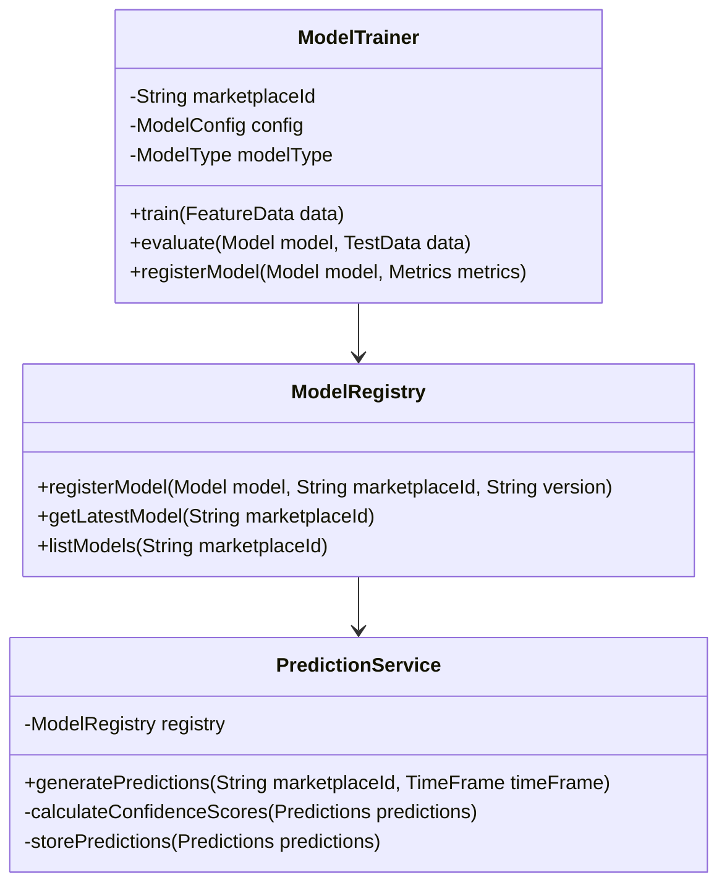
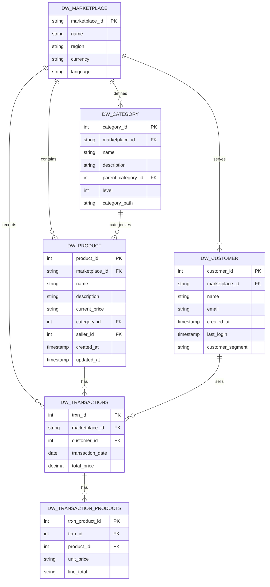
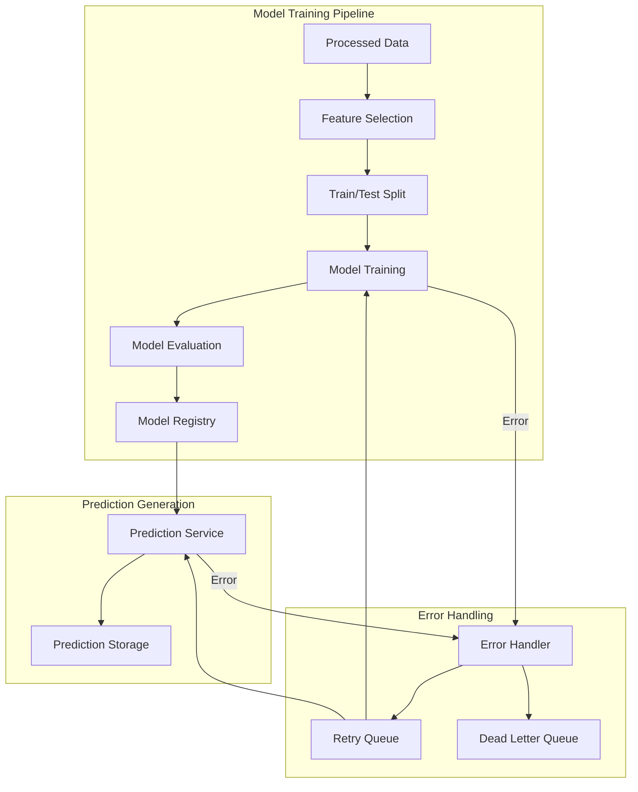
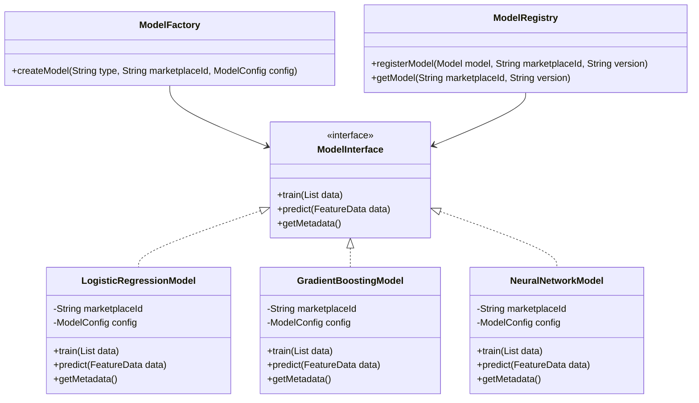
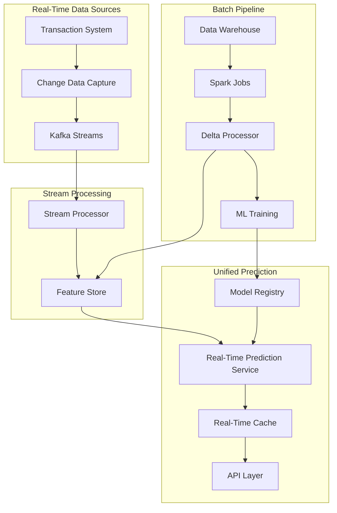
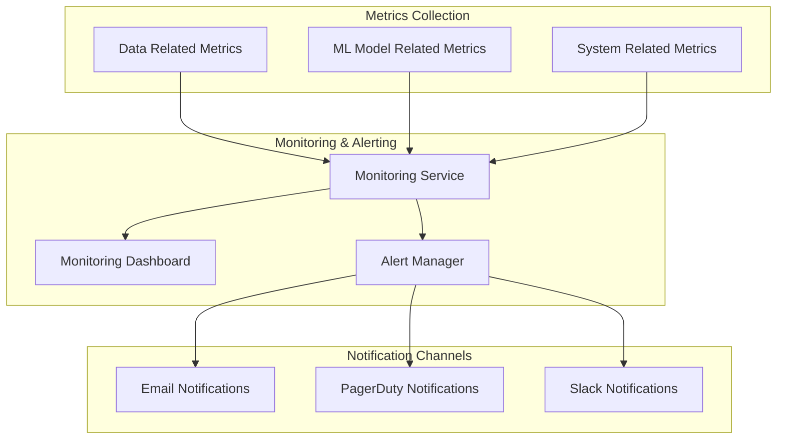
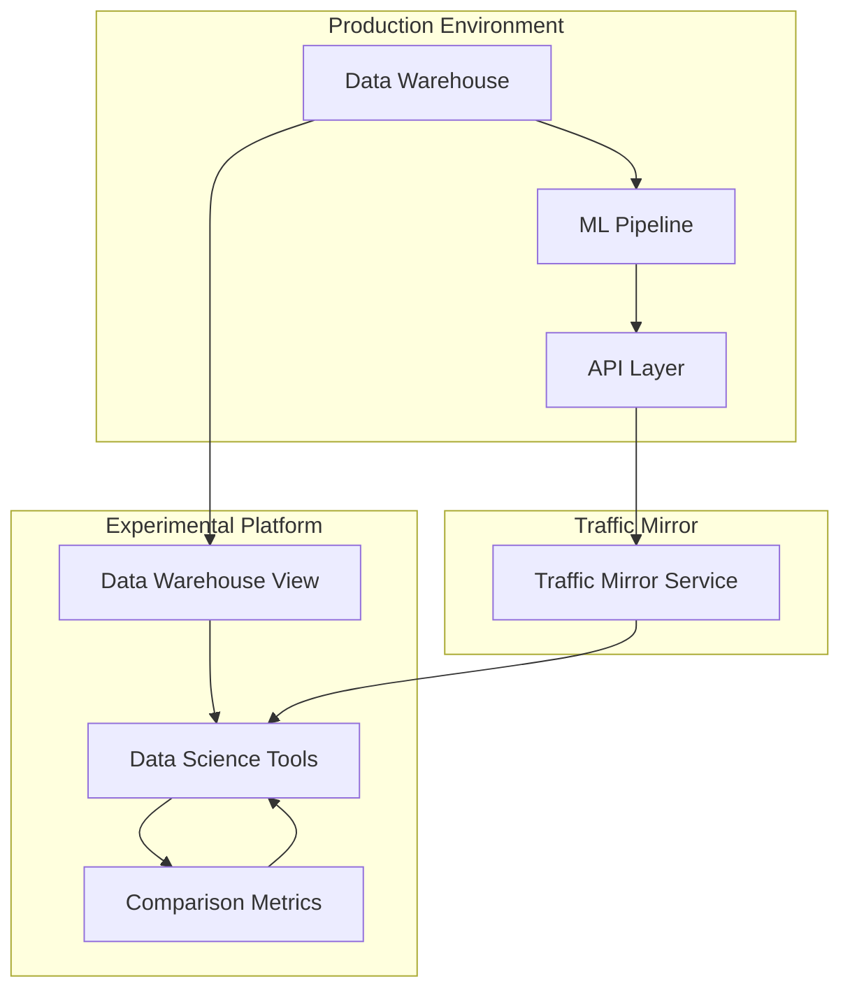

# E-commerce Product Prediction System Design

A comprehensive design document for a scalable system that predicts top-selling products by category over different time frames across multiple marketplaces.

## Table of Contents

1. [Problem Statement](#problem-statement)
2. [Requirements](#requirements)
   - [Functional Requirements](#functional-requirements)
   - [Non-Functional Requirements](#non-functional-requirements)
3. [High-Level Design](#high-level-design)
4. [Low-Level Design](#low-level-design)
5. [Data Architecture](#data-architecture)
6. [API Design](#api-design)
7. [ML Pipeline](#ml-pipeline)
8. [Error Handling & Recovery](#error-handling--recovery)
9. [Challenges & Solutions](#challenges--solutions)
   - [Batch Processing Challenges](#batch-processing-challenges)
   - [Prediction Accuracy Challenges](#prediction-accuracy-challenges)
   - [Consistency & Availability Challenges](#consistency--availability-challenges)
10. [Monitoring & Alerting](#monitoring--alerting)
11. [Phased Implementation](#phased-implementation)

## Problem Statement

E-commerce marketplace sellers across multiple global marketplaces (US, UK, DE, FR, AUS, etc.) need data-driven insights to optimize their inventory, pricing, and marketing strategies. Currently, they lack the ability to predict which products will be top sellers in different categories over various time frames (week, month, year). This makes it difficult for them to make informed business decisions, leading to potential revenue loss, excess inventory, or stockouts.

We need to develop a feature that can analyze historical transaction data and predict the top-selling products by category over different selectable time frames for each marketplace. This will help sellers optimize their business operations and increase their revenue on the marketplace.

## Requirements

### Functional Requirements

1. **User Scale**: Support 1 million Daily Active Users (DAU) across all marketplaces
2. **Data Source**: 
   - Utilize existing Data Warehouse with 8-hour refresh cycle
   - Initially focus on batch processing of historical transactions
   - Future extension to real-time predictions
3. **Marketplace Support**: 
   - Support 10 global marketplaces (US, UK, DE, FR, AUS, etc.)
   - Phased rollout based on marketplace traffic
4. **Category Support**: 
   - Handle marketplace-specific categories (100 categories per marketplace)
   - System should be agnostic of category tree changes and new category additions
   - Pagination support (top 5 categories initially)
5. **Time Frame Support**: 
   - Week, month, and year initially
   - Scalable architecture for future time frames (quarter, half-yearly, etc.)
6. **Data Processing**:
   - Leverage existing Data Warehouse infrastructure
   - Process data for ML model consumption
   - Extensible for Change Data Capture for real-time predictions in the future
7. **Prediction Capabilities**:
   - Forecast top-selling products by category per marketplace
   - Provide confidence scores for predictions (May or may not be displayed on the front-end based on Product feedback)
   - Support different time frames for predictions
8. **Model Management**:
   - Initial MVP with logistic regression - simple ML model
   - Support for plug-and-play of different ML models
   - Minimal impact when switching models
   - No impact whatsover for customer

### Non-Functional Requirements

1. **Performance**:
   - API response time or P95 under 100ms
   - Efficient handling of 1M DAU across marketplaces utilizing cache
2. **Scalability**:
   - Support for increasing data volume and user base. Horizontal scaling for all underlying services
   - Efficient handling of traffic spikes - Holiday shopping, Seasonal shifts
3. **Availability and Consistency**:
   - 99.9999% system availability
   - Graceful degradation during partial outages
   - Batch processing aligned with Data Warehouse refresh cycle
   - Consistent prediction results across replicated services
5. **Security**:
   - Secure access to prediction data. Use existing login authentication
6. **Maintainability**:
   - Modular architecture for easy updates
   - Comprehensive monitoring and alerting
   - Monitoring ML model bias, response time, accuracy, etc
   - Well-documented code and architecture

## High-Level Design



### Key Components

1. **Data Sources**:
   - Existing Data Warehouse: Contains product, customer, transaction, and category data
   - Refreshes every 8 hours from source databases
   - Sharded by customer

2. **Data Extraction**:
   - Spark Jobs: Extract data from the warehouse after each refresh
   - Push extracted data to a queue for processing
   - Data Queue: Decouples extraction from processing for better scalability

3. **Data Processing**:
   - Delta Processor: Processes only new or changed data since last run
   - Feature Engineering: Creates features for ML models based on delta data
   - Scheduled to run after each Data Warehouse refresh

4. **ML System**:
   - ML Training Pipeline: Trains prediction models on historical data per marketplace
   - Model Registry: Stores and versions trained models
   - Prediction Service: Generates forecasts for different time frames
   - Prediction Storage: Stores prediction results with metadata

5. **API Layer**:
   - Prediction API: Serves predictions to frontend applications
   - API Cache: Improves response time for frequent queries

6. **Frontend**:
   - Dashboard UI: Seller-facing interface for viewing predictions. Can slice and dice data based on backend responses

7. **Monitoring**:
   - Data Source Related Alerts: Ensures data integrity and freshness
   - ML Model Related Alerts: Tracks prediction accuracy, biases, response time, etc
   - System Related Alerts: Monitors system components, availability, errors and P99, P95 latency

## Low-Level Design

### Component Interactions



### Data Extraction and Processing Components



### ML Pipeline Component




## Data Architecture



### Time-Based Data Storage

The existing Data Warehouse is already set up with the following characteristics:

1. **Sharding Strategy**:
   - Sharded by marketplace, date, and seller for efficient querying
   - Enables marketplace-specific and seller-specific data access
   - Optimizes query performance for time-based analysis

2. **Refresh Cycle**:
   - Data Warehouse refreshes every 8 hours from source databases
   - Prediction refresh should align with this 8-hour cycle
   - No need for a separate time series database for MVP phase

3. **Pre-Aggregated Views**: Marketplace-specific materialized views for different time granularities:
   ```sql
   -- Example of pre-aggregated tables with marketplace and seller partitioning
   CREATE TABLE agg_sales_weekly (
     marketplace_id VARCHAR(10),
     year INT,
     week INT,
     seller_id INT,
     category_id INT,
     product_id INT,
     total_quantity INT,
     total_amount DECIMAL(18,2),
     num_transactions INT,
     avg_unit_price DECIMAL(10,2),
     week_start_date DATE,
     week_end_date DATE,
     PRIMARY KEY (marketplace_id, year, week, seller_id, category_id, product_id)
   )
   PARTITION BY LIST (marketplace_id);
   
   CREATE TABLE agg_sales_monthly (
     marketplace_id VARCHAR(10),
     year INT,
     month INT,
     seller_id INT,
     category_id INT,
     product_id INT,
     total_quantity INT,
     total_amount DECIMAL(18,2),
     num_transactions INT,
     avg_unit_price DECIMAL(10,2),
     month_start_date DATE,
     month_end_date DATE,
     PRIMARY KEY (marketplace_id, year, month, seller_id, category_id, product_id)
   )
   PARTITION BY LIST (marketplace_id);
   
   CREATE TABLE agg_sales_yearly (
     marketplace_id VARCHAR(10),
     year INT,
     seller_id INT,
     category_id INT,
     product_id INT,
     total_quantity INT,
     total_amount DECIMAL(18,2),
     num_transactions INT,
     avg_unit_price DECIMAL(10,2),
     PRIMARY KEY (marketplace_id, year, seller_id, category_id, product_id)
   )
   PARTITION BY LIST (marketplace_id);
   ```

4. **Prediction Storage**: NoSQL document store for flexible prediction storage with marketplace partitioning:
   ```json
   {
     "prediction_id": "uuid",
     "marketplace_id": "US",
     "time_frame": "week",
     "period_start": "2025-07-25T00:00:00Z",
     "period_end": "2025-08-01T23:59:59Z",
     "generation_timestamp": "2025-08-01T15:05:35Z",
     "refresh_cycle_id": "US-20250801-1",
     "model_version": "US-logistic-1.0.0",
     "categories": [
       {
         "category_id": 42,
         "category_name": "Electronics",
         "predicted_sales_amount": 1250000.00,
         "confidence_score": 0.89,
         "rank": 1,
         "top_products": [
           {
             "product_id": 1234,
             "product_name": "Smartphone X",
             "seller_id": 5678,
             "predicted_quantity": 500,
             "predicted_amount": 450000.00,
             "confidence_score": 0.92,
             "rank": 1
           }
         ]
       }
     ]
   }
   ```


## API Design

### Prediction API Endpoints

#### Get Top Categories
```
GET /api/v1/predictions/customer/{customerId}/marketplace/{marketplaceId}/categories
```

Query Parameters:
- `timeFrame`: week|month|year (required)
- `dateTime`: YYYY-MM-DD:HH:mm:ss (optional, defaults to current time)
- `limit`: Number of categories to return (optional, defaults to 5)
- `page`: Page number for pagination (optional, defaults to 1)
- `sort`: asc/desc (optional, defaults to desc or top selling categories)

Response:
```json
{
  "marketplaceId": "US",
  "customerId": 1234,
  "timeFrame": "week",
  "periodStart": "2025-07-25T00:00:00Z",
  "periodEnd": "2025-08-01T23:59:59Z",
  "totalCategories": 100,
  "page": 1,
  "limit": 5,
  "lastRefreshed": "2025-08-01T15:05:35Z",
  "categories": [
    {
      "categoryId": 42,
      "categoryName": "Electronics",
      "predictedSalesAmount": 1250000.00,
      "confidenceScore": 0.89
    }
  ]
}
```

#### Get Top Products by Category
```
GET /api/v1/predictions/customer/{customerId}/{marketplaceId}/categories/{categoryId}/products
```

Query Parameters:
- `timeFrame`: week|month|year (required)
- `dateTime`: YYYY-MM-DD:HH:mm:ss (optional, defaults to current time)
- `limit`: Number of products to return (optional, defaults to 5)
- `page`: Page number for pagination (optional, defaults to 1)

Response:
```json
{
  "marketplaceId": "US",
  "categoryId": 42,
  "categoryName": "Electronics",
  "timeFrame": "week",
  "periodStart": "2025-07-25T00:00:00Z",
  "periodEnd": "2025-08-01T23:59:59Z",
  "totalProducts": 150,
  "page": 1,
  "limit": 5,
  "lastRefreshed": "2025-08-01T15:05:35Z",
  "products": [
    {
      "productId": 1234,
      "productName": "Smartphone X",
      "sellerId": 5678,
      "sellerName": "Tech Store",
      "predictedQuantity": 500,
      "predictedAmount": 450000.00,
      "confidenceScore": 0.92
    }
  ]
}
```
GraphQL can be used if the need be

## ML Pipeline



### ML Pipeline Components

1. **Feature Engineering**:
   - Marketplace-specific features
   - Time-based features (day of week, month, seasonality)
   - Product features (price, category, attributes)
   - Historical sales patterns (velocity, acceleration)
   - Category-level aggregations

2. **Model Training**:
   - MVP approach: Logistic regression for simplicity and interpretability
   - Separate models for each marketplace
   - Separate models for different time frames
   - Idempotent training with retry capability

3. **Model Registry**:
   - Versioned model storage
   - Marketplace-specific model management
   - Model metadata and performance metrics
   - A/B testing support for future phases

4. **Prediction Service**:
   - Scheduled prediction generation after DW refresh
   - Idempotent prediction generation with retry capability
   - Confidence score calculation
   - Marketplace-specific prediction storage

### Model Plug-and-Play Architecture



The plug-and-play architecture enables:

1. **Easy Model Swapping**:
   - All models implement the same interface
   - Models can be swapped without changing the pipeline
   - New model types can be added without disrupting existing functionality

2. **Marketplace-Specific Models**:
   - Each marketplace has its own model instances
   - Models are trained on marketplace-specific data
   - Models account for marketplace-specific categories

3. **Testing in Pre-Production**:
   - Mirror traffic to test new models without affecting production
   - Compare performance of different model types
   - Promote successful models to production with minimal disruption

### Delta Processing and Model Training

While the delta processor only processes new or changed data, the ML model training requires more context than just the delta. Here's how the system handles this:

1. **Feature Store Integration**:
   - The delta processor updates a feature store with new/changed features
   - The feature store maintains the complete, up-to-date feature set
   - This ensures we have a consistent view of all features for training

2. **Training Approaches**:
   - **Full Training**: The model is trained on the complete dataset from the feature store, not just the delta. This ensures the model learns from the entire dataset but is computationally expensive.
   - **Windowed Training**: The model is trained on a sliding window of recent data (e.g., last 6 months). This balances between full retraining and incremental updates.
   - **Incremental Training**: For algorithms that support it, the model is updated with just the new data without retraining from scratch.

3. **MVP Approach**:
   - For the initial implementation, we'll use the windowed training approach
   - This provides a good balance between prediction quality and computational efficiency
   - Training will occur after each significant data warehouse refresh

## Future Real-Time Prediction Extension

As the system matures, we plan to extend it with real-time prediction capabilities. This section outlines the approach for this future enhancement.

### Real-Time Architecture Extension



### Key Components for Real-Time Extension

1. **Change Data Capture (CDC)**:
   - Captures changes from transaction systems in real-time
   - Streams changes to Kafka for immediate processing
   - Enables near real-time feature updates

2. **Stream Processing**:
   - Processes event streams as they occur
   - Updates features incrementally
   - Maintains stateful aggregations for recent time windows

3. **Feature Store**:
   - Serves as a unified repository for both batch and real-time features
   - Ensures consistency between batch and streaming pipelines
   - Provides point-in-time feature lookups

4. **Real-Time Prediction Service**:
   - Uses the same models from the Model Registry
   - Generates predictions on demand using latest features
   - Caches frequent predictions for fast access

### Benefits of Real-Time Extension

1. **Fresher Predictions**: Updates within minutes instead of waiting for the 8-hour DW refresh
2. **Improved User Experience**: More responsive seller dashboard with up-to-date predictions
3. **Better Handling of Flash Sales**: Quickly adapts to sudden changes in buying patterns
4. **Competitive Advantage**: Sellers can react faster to market trends

## Challenges & Solutions

### Batch Processing Challenges

1. **Data Warehouse Refresh Cycle**:
   - **Challenge**: The 8-hour refresh cycle limits prediction freshness
   - **Solution**: Align prediction generation with DW refresh cycle and clearly communicate last refresh time to users

2. **Processing Large Volumes of Data**:
   - **Challenge**: Processing marketplace-specific data efficiently
   - **Solution**: Implement parallel processing by marketplace and leverage DW partitioning


### Prediction Accuracy Challenges

1. **Cold Start Problem**:
   - **Challenge**: New products have no historical data for predictions
   - **Solution**: Initially target this feature to high volume sellers. Use category averages and similar product data for initial predictions

2. **Seasonal Variations**:
   - **Challenge**: Sales patterns vary by season, holidays, and special events
   - **Solution**: Include cyclical time features and special event markers in the model

3. **Promotion Effects**:
   - **Challenge**: Promotions and discounts significantly impact sales patterns
   - **Solution**: Include promotion awareness in features and create separate models for promotional periods

### Consistency & Availability Challenges

1. **CAP Theorem Trade-offs**:
   - **Challenge**: Balancing consistency and availability in a distributed system
   - **Solution**: Use different consistency models for different components:
     - Strong consistency for transaction processing
     - Eventual consistency for prediction results
     - Read-after-write consistency for user interactions

2. **Data Replication**:
   - **Challenge**: Maintaining consistency across replicated data stores
   - **Solution**: Implement tiered replication strategy with synchronous replication for critical data and asynchronous replication for analytics

3. **Partial Failures**:
   - **Challenge**: Handling partial system failures without affecting user experience
   - **Solution**: Implement circuit breakers, fallback mechanisms, and graceful degradation

## Monitoring & Alerting



### Key Metrics to Monitor

1. **Data Related Metrics**:
   - Data freshness (time since last update)
   - Spark job failures
   - Anomaly detection in data distributions

2. **ML Model Related Metrics**:
   - Prediction accuracy vs. actual sales
   - Model drift detection

3. **System Related Metrics**:
   - API response times P95, P99
   - Error rates
   - Resource utilization (CPU, memory, disk)
   - Queue backlogs for async jobs

## Traffic Mirrored Preproduction Environment

To enable continuous learning and experimentation without disrupting the main production pipeline, we will establish a traffic mirrored preproduction environment. This environment will allow the data science team to test different ML models and approaches using real production data patterns.



### Key Components

1. **Traffic Mirror Service**:
   - Captures a configurable percentage of production API requests
   - Forwards these requests to the experimental prediction service
   - Does not affect the production response time or reliability
   - Can be configured to mirror specific marketplaces or user segments

2. **Data Warehouse View**:
   - Read-only view of the production data warehouse
   - No impact on production data processing
   - Provides the same data structure and content as production

3. **Data Science Workbench**:
   - Jupyter notebooks and other data science tools
   - Environment for developing and testing new models
   - Access to historical prediction data and actual sales outcomes
   - Support for various ML frameworks and libraries


## Phased Implementation

### Phase 1: MVP with Basic Pipeline
- **Goal**: Establish basic prediction pipeline with logistic regression for 1 marketplace
- **Key Components**:
  - Data processing from existing Data Warehouse
  - Basic feature engineering
  - Slow ramp per marketplace
  - Logistic regression model for weekly predictions
  - Simple API for top categories and products
  - Basic monitoring
- **Success Criteria**:
  - Prediction accuracy within 25% of actual sales
  - API response time under 100ms for 95% of requests
  - 99.999% system availability

### Phase 2: Marketplace Expansion
- **Goal**: Expand to additional marketplaces based on traffic
- **Rollout Order**:
  1. DE (already in Phase 1)
  2. FR
  3. UK
  4. US
  5. Other marketplaces based on traffic
- **Key Enhancements**:
  - Marketplace-specific category handling
  - Improved feature engineering
  - Enhanced monitoring and alerting
- **Success Criteria**:
  - Successful onboarding of all marketplaces
  - Consistent performance across marketplaces

### Phase 3: Prediction and Usage Analysis with Feedback Collection
- **Goal**: Analyze predictions based on previously predicted sales vs current sales along with usage patterns and collect seller feedback
- **Key Activities**:
  - Establish traffic mirror environment for algorithm testing
  - Evaluate model predictions and work with Data Science team
  - Test environment for data science team
  - Multiple model testing capability
  - Performance comparison framework
  - Implement usage tracking
  - Analyze seller segments using the feature
  - Collect and categorize feedback
  - Identify improvement opportunities
- **Success Criteria**:
  - Better prediction with data and stronger confidence provided by Data Science team
  - Ability to test multiple algorithms in parallel
  - Clear performance comparison metrics
  - Comprehensive usage analysis report
  - Clear understanding of seller needs
  - Prioritized list of enhancements
  - Influence stakeholder decision
